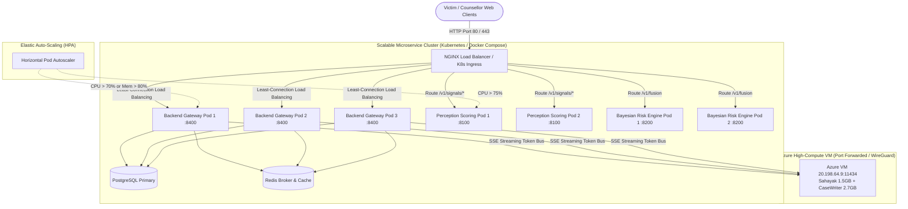

# 🚀 DevOps, Horizontal Scaling & Load Balancing Architecture
**SIH 2026 PS-26094 · Victim Distress Monitoring & Legal Support System**

This document provides a comprehensive technical guide to the **containerization (Docker)**, **clustering & load balancing (NGINX)**, and **orchestrated auto-scaling (Kubernetes & HPA)** implemented across the PS-26094 microservices ecosystem.

---

## 1. System Architecture Overview



---

## 2. Load Balancing Layer (NGINX Reverse Proxy)

### Location: `infra/nginx/nginx.conf`
The system deploys an **NGINX Edge Load Balancer** sitting directly in front of the application microservices.

### Key Capabilities:
1. **Least-Connection Balancing (`least_conn`)**:
   Instead of simple round-robin, requests are forwarded to the container with the lowest count of active connections. This is critical for long-running Server-Sent Events (SSE) chat streams.
2. **Health Check Failover (`max_fails=3 fail_timeout=10s`)**:
   If a replica crashes or experiences network degradation, NGINX automatically removes it from the upstream pool without dropping client traffic.
3. **Path-Based Routing**:
   - `/v1/signals/*` $\rightarrow$ Dedicated `scoring_cluster` (PyTorch MuRIL / Threat models)
   - `/v1/fusion` $\rightarrow$ Dedicated `risk_cluster` (Bayesian linear-Gaussian engine)
   - `/*` $\rightarrow$ Scaled `backend_cluster` (Central FastAPI API Gateway)
4. **Rate Limiting Protection (`limit_req_zone`)**:
   Prevents duress Denial-of-Service (DoS) attacks by capping traffic at 100 requests/minute per IP with a burst allowance of 20.
5. **SSE Stream Preservation (`proxy_buffering off`)**:
   Ensures that tokens streamed from Sahayak and CaseWriter on the Azure VM pass straight through to the browser with zero latency.

---

## 3. Local Multi-Replica Scaling (Docker Compose)

### Location: `docker-compose.scale.yml`
You can test and demonstrate multi-container scaling on any developer machine using Docker Compose.

### How to Run:
```bash
# 1. Spin up the cluster with 3 Backend replicas and 2 Scoring replicas:
docker compose -f docker-compose.scale.yml up --scale backend=3 --scale scoring=2 -d

# 2. Inspect running load-balanced containers:
docker compose -f docker-compose.scale.yml ps

# 3. View load balancer traffic logs across instances:
docker compose -f docker-compose.scale.yml logs -f loadbalancer

# 4. Stop the cluster:
docker compose -f docker-compose.scale.yml down
```

---

## 4. Production Kubernetes Architecture (`k8s/`)

The `k8s/` folder contains enterprise-ready, declarative manifests targeting minikube, MicroK8s, AKS (Azure Kubernetes Service), or EKS.

| Manifest File | Kind | Description |
| :--- | :--- | :--- |
| [`k8s/namespace.yaml`](file:///e:/hh4/ps26094-unified/k8s/namespace.yaml) | `Namespace` | Isolates all resources inside the `sih-distress` namespace |
| [`k8s/configmap-secrets.yaml`](file:///e:/hh4/ps26094-unified/k8s/configmap-secrets.yaml) | `ConfigMap` & `Secret` | Centralized database URLs, Fernet keys, and Azure VM addresses |
| [`k8s/postgres-redis.yaml`](file:///e:/hh4/ps26094-unified/k8s/postgres-redis.yaml) | `Deployment` & `Service` | High-availability PostgreSQL database and Redis worker cache |
| [`k8s/backend-deployment.yaml`](file:///e:/hh4/ps26094-unified/k8s/backend-deployment.yaml) | `Deployment` & `Service` | Scaled FastAPI gateway (`replicas: 3`) with zero-downtime rolling updates |
| [`k8s/scoring-deployment.yaml`](file:///e:/hh4/ps26094-unified/k8s/scoring-deployment.yaml) | `Deployment` & `Service` | Perception models with memory/CPU limits and liveness probes |
| [`k8s/risk-engine-deployment.yaml`](file:///e:/hh4/ps26094-unified/k8s/risk-engine-deployment.yaml) | `Deployment` & `Service` | Bayesian fusion engine cluster |
| [`k8s/ingress.yaml`](file:///e:/hh4/ps26094-unified/k8s/ingress.yaml) | `Ingress` | Ingress Controller load balancing external traffic into services |
| [`k8s/hpa.yaml`](file:///e:/hh4/ps26094-unified/k8s/hpa.yaml) | `HorizontalPodAutoscaler` | Dynamic autoscaling based on CPU/Memory load |

---

## 5. Elastic Auto-Scaling Mechanics (HPA)

The **Horizontal Pod Autoscaler** dynamically monitors resource utilization via Kubernetes Metrics Server.

### Scaling Policy Configuration:
- **Backend API Gateway**:
  - **Min Replicas**: `2`
  - **Max Replicas**: `10`
  - **Scale-Out Trigger**: Average CPU utilization $> 70\%$ **OR** Memory $> 80\%$
  - **Scale-Up Responsiveness**: Instant scaling (up to 100% capacity added every 15 seconds)
  - **Scale-Down Stabilization**: 60-second cooldown window to prevent flapping/thrashing during traffic spikes
- **Perception Scoring Engine**:
  - **Min Replicas**: `2`
  - **Max Replicas**: `6`
  - **Scale-Out Trigger**: Average CPU utilization $> 75\%$

---

## 6. Zero-Downtime Deployment Strategy

All microservice deployments utilize Kubernetes **RollingUpdate**:
```yaml
strategy:
  type: RollingUpdate
  rollingUpdate:
    maxSurge: 1       # Temporarily launch 1 extra pod during upgrades
    maxUnavailable: 0 # Never allow active replicas to fall below baseline
```
This guarantees **100% availability during code updates or security patches**, ensuring victim check-in and SOS emergency services are never interrupted.

---

## 7. Commands to Show Evaluators / Professors

```bash
# 1. Apply the entire Kubernetes architecture
kubectl apply -f k8s/

# 2. Verify all pods, services, and replicas are running
kubectl get pods,svc,hpa -n sih-distress

# 3. Simulate traffic load to trigger auto-scaling
kubectl run -i --tty load-generator --rm --image=busybox --restart=Never -n sih-distress -- /bin/sh -c "while true; do wget -q -O- http://backend-service:8400/; done"

# 4. Watch HPA automatically scale pods in real time
kubectl get hpa backend-hpa -n sih-distress --watch
```
